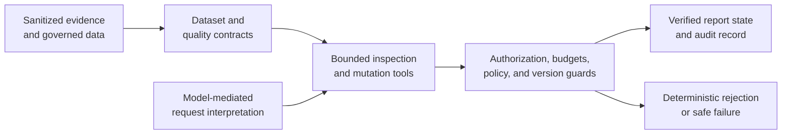

# DuckDive

[](https://github.com/Big-jpg/vic-house-data-lab/actions/workflows/ci.yml)

DuckDive is an engineering case study in **bounded agentic business intelligence**. It explores a contract-first alternative to giving an AI model unrestricted access to data and report state: the model may interpret a request, but deterministic code owns authorization, query limits, analytical policy, version checks, and the single permitted save.

The repository is designed to be reviewed without credentials, live customer data, MotherDuck access, or a deployment.

## Why DuckDive exists

Business-intelligence systems often distribute meaning across a semantic model, application code, data transformations, and analyst convention. DuckDive asks whether those responsibilities can be made more inspectable: explicit dataset contracts define meaning, governed views implement analytical rules, bounded tools expose narrow actions, and tests prove the refusal and failure paths.

The result is not an autonomous analyst. It is a controlled analytical workflow in which model judgment operates inside code-enforced boundaries.

## Responsibility-based architecture



The model proposes meaning and actions. The surrounding application determines what data it may inspect, which capability it may use, whether a change is valid, and whether anything is saved. The complete component and trust-boundary map is in [`docs/architecture.md`](docs/architecture.md).

## 90-second reviewer walkthrough

1. Read the [Price Frontier case study](docs/case-studies/price-mileage-frontier.md) to see a Ford Ranger question evolve into a reusable analytical operator.
2. Inspect the [nine review-safe visual derivatives](docs/assets/price-frontier/README.md) that preserve the observed report progression without publishing source listing identifiers.
3. Read the [bounded control loop](docs/agent-control-loop.md) to distinguish model-mediated classification from deterministic enforcement.
4. Run `corepack pnpm review:verify` to reproduce the frontier against a wholly synthetic fixture using independent SQL and TypeScript implementations.
5. Run `corepack pnpm review:readiness` to check repository links, structure, public claims, provenance files, and tracked-file safety.

## What the experiment discovered

A conventional price-versus-mileage report evolved through conversation into a market-wide union of local frontiers:

- A listing becomes a candidate only when its asking price is below its own make/model cohort's 25th percentile and that cohort contains at least 10 priced listings.
- A legitimate comparison peer must share the make and model and fall within plus or minus two manufacturer years.
- A candidate is removed only when one peer is both strictly cheaper and strictly lower-mileage.
- Make/All and All/All views combine locally evaluated results; they do not compare unrelated vehicle cohorts directly.

Price and distance remain separate measures. The frontier is not a valuation, bargain score, transaction record, or purchase recommendation. The original version 16 Dive source is unavailable; the repository labels the screenshots as observed historical artifacts and the executable implementation as a reference reconstruction.

## How the agent is bounded

The application can:

- interpret an analytical or presentation request;
- perform one allowlisted, result-capped inspection;
- prepare one structured change plan;
- attempt one policy-checked mutation; and
- report success only after version and content verification.

It cannot:

- execute arbitrary public SQL or use an unknown capability;
- cross workspace ownership boundaries;
- bypass report-policy validation through configuration;
- retry preparation, inspection, or mutation without bound;
- save after a stale-version conflict or failed validation; or
- turn asking-price evidence into fair value, sale, suitability, or purchase claims.

Semantic request classification remains model-mediated. The contracts and deterministic guards constrain its consequences; they do not make model interpretation formally correct.

## Evidence map

| Evidence | What it establishes |
| --- | --- |
| [Price Frontier case study](docs/case-studies/price-mileage-frontier.md) | Observed progression, analytical scopes, caveats, and refusal boundaries |
| [Reference SQL](db/case-studies/price-mileage-frontier.sql) and [synthetic fixture](fixtures/case-studies/price-mileage-frontier.json) | Credential-free reconstruction of the documented method |
| [Architecture](docs/architecture.md) and [control loop](docs/agent-control-loop.md) | Responsibilities, trust boundaries, attempt budgets, and enforcement evidence |
| [Repository map](docs/REPOSITORY_MAP.md) | Current, historical, prototype, and fixture classifications |
| [Review evidence](docs/review/) | Gate-by-gate implementation and validation records |
| [Provenance](docs/PROVENANCE.md) | Source, asset, dependency, and third-party boundaries |

## Credential-free validation

Use Node.js 22 and pnpm 10.28.0. These commands are intentionally offline after the frozen dependency install and do not require `.env.local`:

```bash
corepack pnpm install --frozen-lockfile
corepack pnpm test
corepack pnpm lint
corepack pnpm typecheck
corepack pnpm build
corepack pnpm review:replay
corepack pnpm review:verify
corepack pnpm review:architecture
corepack pnpm review:case-study
corepack pnpm review:assets
corepack pnpm review:links
corepack pnpm review:security
corepack pnpm review:readiness
git diff --check
git status --short
```

The [continuous-integration workflow](.github/workflows/ci.yml) runs the same reviewer baseline on pushes and pull requests.

## Current boundaries

- The WA vehicle-market material is the current preserved experiment; acquisition is disabled and excluded from review.
- VIC housing is retained as a historical experiment, not a currently verified product path.
- Power BI/Fabric import is a tested prototype, and the World Health Organization runtime is a fixture adapter.
- The MotherDuck Business trial and Embedded Dives are unavailable. No live MotherDuck, Neon, Blob, Vercel, or deployment state is claimed.
- Original Price Frontier screenshots and raw vehicle data remain outside Git; only sanitized fixtures and curated derivatives are reviewable.
- No license is currently granted. Read [`LICENSE_STATUS.md`](LICENSE_STATUS.md) before reuse.

Security reporting, contribution expectations, and provenance are documented in [`SECURITY.md`](SECURITY.md), [`CONTRIBUTING.md`](CONTRIBUTING.md), and [`docs/PROVENANCE.md`](docs/PROVENANCE.md).
