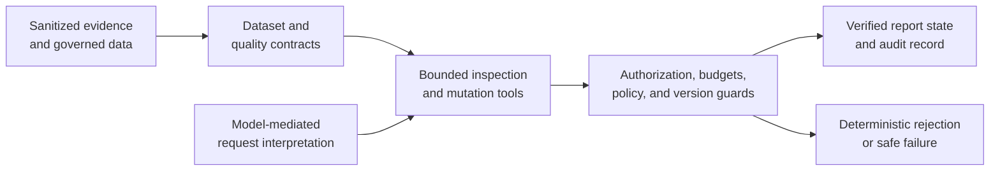

# DuckDive

[](https://github.com/Big-jpg/vic-house-data-lab/actions/workflows/ci.yml)

> **Status: ongoing experiment.** DuckDive is being used to test whether data an organization already owns can become governed, audience-ready analytical views without requiring an enterprise BI programme before the first useful question can be answered.

DuckDive is an engineering case study in **bounded agentic business intelligence**. A person supplies the question, audience, and decision context. An agent may help interpret and present the evidence, but it does not become the analytical authority: contracts, governed views, ownership checks, attempt budgets, version checks, and provenance constrain what it can inspect, change, and claim.

The current repository proves one substantial experiment and preserves earlier dataset work. It is not a finished product. The next product question is whether the method can be repeated cheaply across more curated datasets and, eventually, with a deliberately bounded **bring-your-own-dataset** workflow.

The repository can be reviewed without credentials, live customer data, MotherDuck access, or a deployment.

## Why DuckDive exists

Organizations often collect far more data than they can make useful. The missing piece is not always another warehouse or dashboard. It is the work required to establish grain, meaning, comparability, quality, lineage, and an explanation appropriate to the person making a decision.

Large data teams and enterprise platforms remain necessary for broad governance, regulatory controls, shared semantics, and complex estates. DuckDive does not try to remove them. It asks a narrower question: **can a specific, defensible analytical use case be delivered without buying and operating the entire enterprise stack first?**

That matters for smaller problems as well as large ones. A business trying to improve procure-to-pay performance may only need to expose where time accumulates between order, receipt, approval, scheduling, and payment; which cohorts behave differently; and where the source evidence is incomplete. The useful output is not an agent declaring what the business should do. It is a governed view that makes the observed intervals, exceptions, assumptions, and limits legible enough for the right people to decide.

## The product thesis

DuckDive is exploring a path from owned evidence to reviewable decision support:

```text
Customer-controlled evidence
  -> immutable landing and source inventory
  -> deterministic parsing, profiling, and quality checks
  -> human-confirmed analytical contract
  -> governed DuckDB or DuckLake views
  -> bounded agent inspection and report mutation
  -> versioned, shareable presentation with source lineage
```

Only part of that path is established here. The repository contains dataset contracts, immutable-lineage patterns, governed SQL, owner-scoped report controls, version verification, sanitized replay fixtures, and a bounded agent loop. It does **not** yet provide a general drop-any-file ingestion path, automatic semantic correctness, a completed per-customer privacy architecture, or an end-to-end BYO Dataset experience.

The intended economic shape is progressive rather than all-or-nothing. DuckDB can run embedded and process [larger-than-memory workloads](https://duckdb.org/docs/current/guides/performance/how_to_tune_workloads); MotherDuck adds managed storage, compute tiers, and [read scaling](https://motherduck.com/product/pricing/). That creates a plausible route from a low-cost local or single-workload experiment to managed multi-user analytics as data, concurrency, and service requirements grow. It is a design advantage to measure, not evidence that DuckDive already supports every workload or will always be cheaper than an enterprise platform.

## The case study: one question became a reusable analytical method

The strongest evidence is not that an agent restyled a dashboard. It is that a short conversation progressively made an imprecise decision problem more explicit without inventing a valuation model.

```text
Ordinary price/mileage plot
  -> Ford Ranger question
  -> cohort-relative low-price rule
  -> mileage-aware investigation
  -> strict two-measure frontier
  -> make/model and All/All generalization
  -> explicit contract and refusal boundaries
```

The resulting Price Frontier removes a candidate only when the **same legitimate peer** is both cheaper and lower-mileage. It never decides how many dollars a kilometre is worth. In the observed 11 August 2026 session, the method expanded from one Ford Ranger question to an All/All display of 14,747 listings while preserving local make/model/year comparability. Unlike vehicles could be shown together without being treated as comparable.

That is the broader capability DuckDive is testing: turn a domain question into a transparent analytical operator; retain the definitions and limitations that make it defensible; then present it at the scope the audience needs. Read the [Price Frontier case study](docs/case-studies/price-mileage-frontier.md) for the observed progression, review-safe images, exact rules, and evidence boundary.

## What the experiment discovered

A conventional price-versus-mileage report evolved through conversation into a market-wide union of local frontiers:

- A listing becomes a candidate only when its asking price is below its own make/model cohort's 25th percentile and that cohort contains at least 10 priced listings.
- A legitimate comparison peer must share the make and model and fall within plus or minus two manufacturer years.
- A candidate is removed only when one peer is both strictly cheaper and strictly lower-mileage.
- Make/All and All/All views combine locally evaluated results; they do not compare unrelated vehicle cohorts directly.

Price and distance remain separate measures. The frontier is not a valuation, bargain score, transaction record, or purchase recommendation. The original version 16 Dive source is unavailable; the repository labels the screenshots as observed historical artifacts and the executable implementation as a reference reconstruction.

## What this could make practical

The near-term opportunity is not universal autonomous analysis. It is repeatable support for bounded questions whose evidence and limits can be stated clearly, for example:

- locating lag and exceptions across procure-to-pay or supply-chain intervals;
- comparing operational cohorts without collapsing them into a misleading global average;
- exposing inventory, service, quality, or throughput patterns with their valid sample sizes;
- turning a research dataset into an audience-appropriate, explorable report; and
- preserving multiple report directions from the same governed source without losing reconciliation or lineage.

These are examples to validate, not supported product templates. A useful DuckDive should show what the data reasonably supports, what remains unknown, and how the view was derived. Recommendation, prediction, causal explanation, valuation, or authoritative guidance requires separate evidence and an explicit contract; presentation alone cannot create it.

## Responsibility-based architecture



The model proposes meaning and actions. The surrounding application determines what data it may inspect, which capability it may use, whether a change is valid, and whether anything is saved. The complete component and trust-boundary map is in [`docs/architecture.md`](docs/architecture.md).

## How the agent is bounded

The application can:

- interpret an analytical or presentation request;
- perform one allowlisted, result-capped inspection;
- prepare one structured change plan;
- attempt one policy-checked mutation; and
- report success only after version and content verification.

It cannot:

- execute arbitrary public SQL or use an unknown capability;
- cross workspace ownership boundaries;
- bypass report-policy validation through configuration;
- retry preparation, inspection, or mutation without bound;
- save after a stale-version conflict or failed validation; or
- turn asking-price evidence into fair value, sale, suitability, or purchase claims.

Semantic request classification remains model-mediated. The contracts and deterministic guards constrain its consequences; they do not make model interpretation formally correct.

## What comes next

Future work is organized as falsifiable experiments rather than a promise of general availability:

1. **Repeat the method on more curated datasets.** Test whether a new domain can reuse the control and report lifecycle while keeping its authority in a dataset-specific contract.
2. **Pilot a bounded BYO Dataset path.** Start with a small allowlist of file formats and sizes, preserve the submitted bytes and hashes, inventory deterministically, and require human confirmation of grain, measures, relationships, and sensitive fields before analytical use.
3. **Define the privacy and tenancy boundary.** Decide where source bytes, derived tables, prompts, query results, logs, credentials, and deletions live. Test customer-controlled storage and dedicated workload identities before claiming isolation.
4. **Benchmark the economic claim.** Measure ingestion time, query latency, concurrency, storage, compute, and agent cost from local DuckDB through managed MotherDuck tiers. “You pay as the workload grows” must be demonstrated for representative workloads.
5. **Prove repeatability.** For each dataset, reproduce a useful decision view, an obvious refusal or failure, source reconciliation, version history, sharing, and reset or mutation from the same governed evidence.

“Drag everything into a data pit” is therefore a direction to investigate, not a current promise. Agents may propose file classification or semantic structure, but deterministic code must admit, quarantine, or reject inputs, and a person must remain able to inspect the resulting contract. Privacy cannot be inferred from the fact that a system avoids permanently storing one intermediate representation.

## 90-second reviewer walkthrough

1. Read the [Price Frontier case study](docs/case-studies/price-mileage-frontier.md) to see a Ford Ranger question evolve into a reusable analytical operator.
2. Inspect the [nine review-safe visual derivatives](docs/assets/price-frontier/README.md) that preserve the observed report progression without publishing source listing identifiers.
3. Read the [bounded control loop](docs/agent-control-loop.md) to distinguish model-mediated classification from deterministic enforcement.
4. Run `corepack pnpm review:verify` to reproduce the frontier against a wholly synthetic fixture using independent SQL and TypeScript implementations.
5. Run `corepack pnpm review:readiness` to check repository links, structure, public claims, provenance files, and tracked-file safety.

## Evidence map

| Evidence | What it establishes |
| --- | --- |
| [Price Frontier case study](docs/case-studies/price-mileage-frontier.md) | Observed progression from a specific question to a generalized method, including analytical scopes, caveats, and refusal boundaries |
| [Review-safe visual derivatives](docs/assets/price-frontier/README.md) | The visible report evolution, with source identifiers removed and derivative provenance recorded |
| [Reference SQL](db/case-studies/price-mileage-frontier.sql) and [synthetic fixture](fixtures/case-studies/price-mileage-frontier.json) | Credential-free reconstruction of the documented method, not the historical result |
| [Architecture](docs/architecture.md) and [control loop](docs/agent-control-loop.md) | Responsibilities, trust boundaries, attempt budgets, and enforcement evidence |
| [Repository map](docs/REPOSITORY_MAP.md) | Current, historical, prototype, and fixture classifications |
| [Review evidence](docs/review/) | Gate-by-gate implementation and validation records |
| [Provenance](docs/PROVENANCE.md) | Source, asset, dependency, and third-party boundaries |

## Credential-free validation

Use Node.js 22 and pnpm 10.28.0. These commands are intentionally offline after the frozen dependency install and do not require `.env.local`:

```bash
corepack pnpm install --frozen-lockfile
corepack pnpm test
corepack pnpm lint
corepack pnpm typecheck
corepack pnpm build
corepack pnpm review:replay
corepack pnpm review:verify
corepack pnpm review:architecture
corepack pnpm review:case-study
corepack pnpm review:assets
corepack pnpm review:links
corepack pnpm review:security
corepack pnpm review:readiness
git diff --check
git status --short
```

The [continuous-integration workflow](.github/workflows/ci.yml) runs the same reviewer baseline on pushes and pull requests.

## Current boundaries

- The WA vehicle-market material is the current preserved experiment; acquisition is disabled and excluded from review.
- VIC housing is retained as a historical experiment, not a currently verified product path.
- Power BI/Fabric import is a tested prototype, and the World Health Organization runtime is a fixture adapter.
- BYO Dataset is a planned experiment, not an available ingestion or reporting workflow.
- The current implementation does not establish one Postgres account and DuckLake per customer, arbitrary-file interpretation, or a verified customer-data privacy boundary.
- The MotherDuck Business trial and Embedded Dives are unavailable. No live MotherDuck, Neon, Blob, Vercel, or deployment state is claimed.
- Original Price Frontier screenshots and raw vehicle data remain outside Git; only sanitized fixtures and curated derivatives are reviewable.
- No license is currently granted. Read [`LICENSE_STATUS.md`](LICENSE_STATUS.md) before reuse.

Security reporting, contribution expectations, and provenance are documented in [`SECURITY.md`](SECURITY.md), [`CONTRIBUTING.md`](CONTRIBUTING.md), and [`docs/PROVENANCE.md`](docs/PROVENANCE.md).
