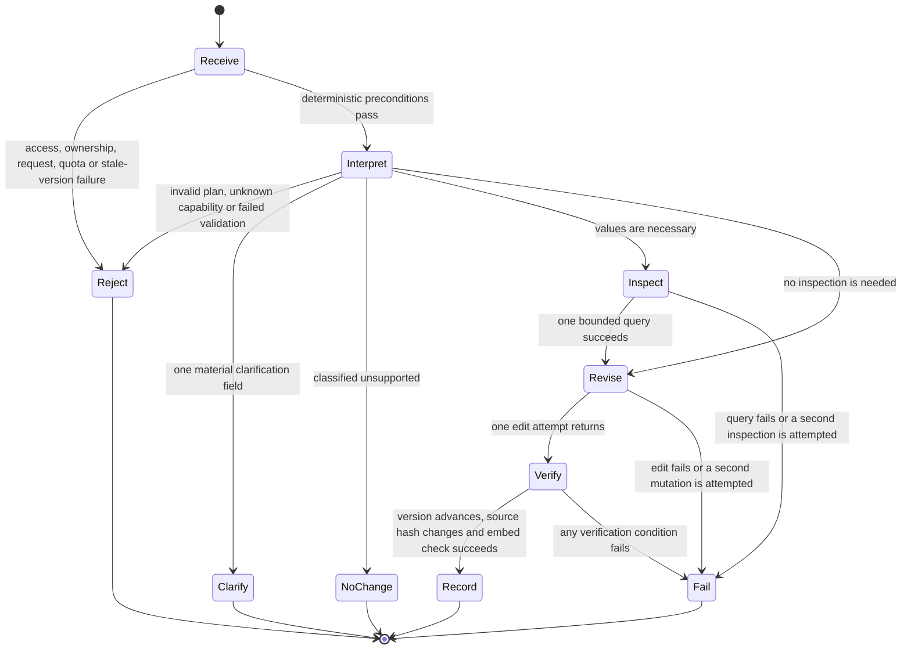

# DuckDive agent control loop

Status: repository-proven control map; live external runtime unavailable  
Updated: 19 August 2026

## Outcome

One DuckDive run can interpret one user brief through one preparation attempt, optionally inspect governed data once, attempt one complete report mutation, verify the resulting version and source hash, and record the outcome. Unsupported or materially ambiguous plans cannot be replaced by a second classification and cannot save. A failed edit or failed verification cannot be reported by the control layer as a successful mutation.

The language model participates inside this loop; it does not control the loop itself.

## State machine

## Transition evidence

| Transition | Deterministic condition | Agent role | Code and test evidence |
| --- | --- | --- | --- |
| Receive to Reject | Same-origin, session, request schema, brief length, ownership, editable dataset, quota, active-run serialization, and expected version | None | [`src/app/api/chat/route.ts`](../src/app/api/chat/route.ts), [`src/lib/duckdive-request.test.ts`](../src/lib/duckdive-request.test.ts), [`src/lib/duckdive-runtime.test.ts`](../src/lib/duckdive-runtime.test.ts) |
| Receive to Interpret | All preconditions pass; current contract, policy, version, and source are assembled | Interpret the brief from supplied context | [`src/app/api/chat/route.ts`](../src/app/api/chat/route.ts) |
| Interpret to Reject | The one preparation attempt does not parse, requests an unknown capability, or contains a failed validation | Produce the structured plan | [`src/lib/duckdive-report.ts`](../src/lib/duckdive-report.ts), [`src/lib/duckdive-report.test.ts`](../src/lib/duckdive-report.test.ts) |
| Interpret to Clarify | The accepted structured shape contains one non-null `materialClarification`; save is then blocked | Decide whether ambiguity is material and phrase one focused question | [`src/lib/duckdive-tools.ts`](../src/lib/duckdive-tools.ts), [`src/lib/duckdive-tools.test.ts`](../src/lib/duckdive-tools.test.ts) |
| Interpret to NoChange | `unsupportedRequests` is non-empty; save is then blocked | Classify the request against limitations | [`src/lib/duckdive-tools.ts`](../src/lib/duckdive-tools.ts), [`src/lib/duckdive-tools.test.ts`](../src/lib/duckdive-tools.test.ts) |
| Interpret to Inspect | Inspection budget is unused and the query is one read-only statement | Decide whether actual values are required and propose the query | [`src/lib/duckdive-tools.ts`](../src/lib/duckdive-tools.ts) |
| Inspect to Revise | Query is wrapped with `LIMIT 200`; returned JSON is capped at 12,000 characters | Use the bounded result to design the revision | [`src/lib/duckdive-tools.test.ts`](../src/lib/duckdive-tools.test.ts) |
| Interpret to Revise | Plan is accepted with no unsupported request or material clarification | Propose one complete set of exact replacements | [`src/lib/duckdive-tools.ts`](../src/lib/duckdive-tools.ts) |
| Revise to Verify | Run remains active, no prior mutation attempt exists, and the active Dive ID is forced by the server | Supply minimal edits and summary | [`src/lib/duckdive-tools.ts`](../src/lib/duckdive-tools.ts), [`src/lib/duckdive-tools.test.ts`](../src/lib/duckdive-tools.test.ts) |
| Verify to Record | Version is newer, canonical source hash differs, and embed-session creation succeeds | None | [`src/lib/duckdive-runtime.ts`](../src/lib/duckdive-runtime.ts), [`src/lib/duckdive-runtime.test.ts`](../src/lib/duckdive-runtime.test.ts) |
| Record to End | Run finalization succeeds; report metadata and audit records are attempted | Produce a concise user summary | [`src/app/api/chat/route.ts`](../src/app/api/chat/route.ts), [`src/lib/duckdive-db.ts`](../src/lib/duckdive-db.ts), [`src/lib/duckdive-report-db.ts`](../src/lib/duckdive-report-db.ts) |
| Any execution state to Fail | Tool, query, edit, verification, stream, or setup failure | May explain the failure but cannot create a verified mutation | [`src/app/api/chat/route.ts`](../src/app/api/chat/route.ts), [`src/lib/duckdive-tools.test.ts`](../src/lib/duckdive-tools.test.ts) |

## Required scenario coverage

| Scenario | Expected result | Passing test evidence |
| --- | --- | --- |
| Safe analytical change | Accepted plan, one edit, verified mutation | `accepts a safe analytical change and records one verified mutation` in [`src/lib/duckdive-tools.test.ts`](../src/lib/duckdive-tools.test.ts) |
| Presentation-only change | Accepted through `report-presentation`, with normal validation still enforced | `accepts a presentation-only change through the allowlisted capability` in [`src/lib/duckdive-tools.test.ts`](../src/lib/duckdive-tools.test.ts) |
| Unknown capability | Plan rejected; edit tool is not called | `rejects an unknown capability and prevents a save` in [`src/lib/duckdive-tools.test.ts`](../src/lib/duckdive-tools.test.ts) |
| Failed validation | Plan rejected; edit tool is not called | `prevents a save when contract validation fails` in [`src/lib/duckdive-tools.test.ts`](../src/lib/duckdive-tools.test.ts) |
| Valuation request | After model classification, plan is not accepted and cannot save | `makes no save after the model classifies a valuation request as unsupported` in [`src/lib/duckdive-tools.test.ts`](../src/lib/duckdive-tools.test.ts) |
| Sale or sell-through request | After model classification, plan is not accepted and cannot save | `makes no save after the model classifies a sale or sell-through request as unsupported` in [`src/lib/duckdive-tools.test.ts`](../src/lib/duckdive-tools.test.ts) |
| Material ambiguity | One clarification field; no save | `returns one material clarification field and makes no save` in [`src/lib/duckdive-tools.test.ts`](../src/lib/duckdive-tools.test.ts) |
| Inspection | One read-only query attempt, 200-row wrapper, 12,000-character result cap | `permits one bounded read-only inspection and caps both rows and returned characters` in [`src/lib/duckdive-tools.test.ts`](../src/lib/duckdive-tools.test.ts) |
| Stale version | Conflict is returned before run creation or editing | `rejects a stale expected version before editing` in [`src/lib/duckdive-runtime.test.ts`](../src/lib/duckdive-runtime.test.ts) |
| Second mutation | Rejected before a second edit call | `rejects a second mutation attempt` in [`src/lib/duckdive-tools.test.ts`](../src/lib/duckdive-tools.test.ts) |
| Failed version or hash verification | No verified mutation is recorded | `never records a mutation when version or hash verification fails` in [`src/lib/duckdive-tools.test.ts`](../src/lib/duckdive-tools.test.ts) and `requires both a newer version and changed source hash` in [`src/lib/duckdive-runtime.test.ts`](../src/lib/duckdive-runtime.test.ts) |

## What is and is not guaranteed

Deterministic code guarantees one preparation attempt, the accepted plan shape, known capability identifiers, absence of failed validations, one inspection attempt, read-only query form, row and character caps, one mutation attempt, active-run state, active Dive targeting, stale-version rejection, and post-edit version/hash verification.

The model decides natural-language intent, whether a request maps to a capability, whether a limitation applies, whether ambiguity is material, whether inspection is useful, and what edits to propose. Those decisions are bounded after classification, but the classification itself is not a formal semantic guarantee.

The prompt requests exactly one focused clarification question. Code guarantees only one nullable clarification field and blocks save when it is present; final natural-language punctuation and question count remain model-mediated.

## Failure and record boundaries

- A rejected plan never becomes the stored plan used by the save tool.
- An unsupported or clarification-bearing plan is retained for explanation, cannot be replaced by another preparation attempt, and cannot authorize save.
- Inspection and mutation budgets count attempts, so a failed call cannot be retried inside the same run.
- The verified mutation object is assigned only after version, hash, and embed checks succeed.
- Text alone never establishes a save; the route derives applied status from the verified mutation object.
- Run finalization, report metadata, and audit events are separate persistence operations. Metadata or audit failure is logged; it is not evidence that an already verified external edit was rolled back.
- The current MotherDuck Business and Embedded Dives runtime is unavailable for live review. These controls are repository-proven and unit-tested, not reverified production telemetry.
