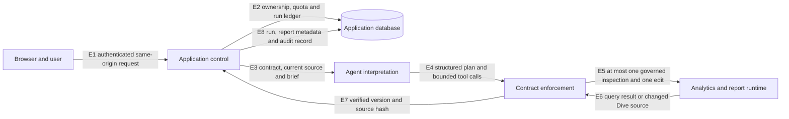

# DuckDive responsibility architecture

Status: repository-proven implementation map with unavailable live dependencies  
Updated: 19 August 2026

## Architectural claim

DuckDive is an experiment in bounded agentic business intelligence. Its semantic layer is distributed across governed data contracts, dataset report policies, structured agent plans, constrained tools, and application controls. The language model does not become a trusted policy engine merely because it can edit a report.

The repository proves the control structure described here. It does not prove that the historical production estate, MotherDuck Business features, or Embedded Dives are currently available. Those live dependencies were not reverified during repository review.

## Responsibility map

Every arrow is implemented; no proposed path appears in the diagram.

| Arrow | Implemented responsibility | Repository evidence |
| --- | --- | --- |
| E1 | Reject cross-origin, unauthenticated, malformed, unowned, or non-editable requests | [`src/app/api/chat/route.ts`](../src/app/api/chat/route.ts), [`src/lib/csrf.ts`](../src/lib/csrf.ts), [`src/lib/auth.ts`](../src/lib/auth.ts) |
| E2 | Resolve workspace ownership, consume quota, serialize active runs, and persist chat state | [`src/lib/app-db.ts`](../src/lib/app-db.ts), [`src/lib/duckdive-db.ts`](../src/lib/duckdive-db.ts) |
| E3 | Supply the active dataset contract, report policy, current version, and current source to the selected model | [`src/app/api/chat/route.ts`](../src/app/api/chat/route.ts), [`src/lib/datasets.ts`](../src/lib/datasets.ts) |
| E4 | Parse the model-produced plan, allowlist capabilities, reject failed validations, and block unsupported or ambiguous saves | [`src/lib/duckdive-report.ts`](../src/lib/duckdive-report.ts), [`src/lib/duckdive-tools.ts`](../src/lib/duckdive-tools.ts) |
| E5 | Permit at most one bounded read-only inspection attempt and at most one report mutation attempt per run | [`src/lib/duckdive-tools.ts`](../src/lib/duckdive-tools.ts) |
| E6 | Execute through the current MotherDuck MCP implementation and read the resulting Dive through server-held credentials | [`src/lib/motherduck-access.ts`](../src/lib/motherduck-access.ts), [`src/lib/duckdive-runtime.ts`](../src/lib/duckdive-runtime.ts) |
| E7 | Require a newer Dive version, a changed canonical source hash, and a successful embed-session check before a mutation is recorded as verified | [`src/lib/duckdive-runtime.ts`](../src/lib/duckdive-runtime.ts), [`src/lib/duckdive-tools.ts`](../src/lib/duckdive-tools.ts) |
| E8 | Finalize the run and attempt to persist versioned report purpose, change manifest, and audit events | [`src/app/api/chat/route.ts`](../src/app/api/chat/route.ts), [`src/lib/duckdive-report-db.ts`](../src/lib/duckdive-report-db.ts), [`src/lib/app-db.ts`](../src/lib/app-db.ts) |

## Four responsibility layers

### Data responsibility

Dataset definitions identify the governed scope, grain, measures, dimensions, caveats, runtime selectors, and starter reports. The active WA vehicle dataset is defined in [`src/lib/dataset-definitions/wa-vehicle-market.ts`](../src/lib/dataset-definitions/wa-vehicle-market.ts); the retained VIC housing definition is historical and unregistered. Dataset-specific SQL and analytical policies remain the authority for what a row or metric means.

The data responsibility does not decide what a user intended. It supplies the meanings and limits against which an intended change can be checked.

### Contract responsibility

Each dataset report policy allowlists analytical capabilities and the shared `report-presentation` capability. It also states limitations and material assumptions. [`validateReportUpdatePlan`](../src/lib/duckdive-report.ts) always performs structural parsing, capability checking, and failed-validation rejection. There is no environment variable or route option that disables this enforcement.

Presentation is allowed without pretending it is an analytical measure. The capability covers layout, chart form, copy, styling, contrast, and accessibility only when governed semantics are preserved.

### Agent responsibility

The selected language model interprets the brief, chooses capability identifiers, identifies unsupported requests, decides whether ambiguity is material, proposes optional inspection, and produces minimal source edits. These are model-mediated judgments. The prompt tells the model to ask one focused question for material ambiguity and to classify valuation, forecasting, recommendation, sale, and other unsupported requests against the supplied policy.

Prompt instructions are not formal guarantees. Deterministic controls validate what the model submits and prevent a rejected plan from reaching the save tool, but they do not prove that every natural-language request will be classified correctly.

### Application and control responsibility

The Next.js route owns authentication, same-origin checks, workspace ownership, expected-version comparison, quota, run serialization, tool construction, response streaming, status finalization, and audit attempts. The tool layer owns the one-inspection and one-mutation budgets. The runtime layer owns post-edit version, source-hash, and embed-session verification.

The report version record is attempted after a verified mutation. A metadata persistence failure is logged and audited but does not roll back a Dive edit that has already been verified. Reviewers should not interpret report metadata as a transactional coordinator for the external Dive runtime.

## Deterministic enforcement and agent judgment

| Concern | Deterministic repository enforcement | Model-mediated or prompted behavior |
| --- | --- | --- |
| Request access | Same-origin, authentication, ownership, editable-dataset, quota, and active-run checks | None |
| Request interpretation | Structured schema bounds the submitted result | Intent, capability selection, unsupported classification, and material ambiguity |
| Capability policy | Unknown identifiers and failed validations are rejected; policy cannot be disabled by configuration | Model chooses identifiers and supplies validation descriptions |
| Presentation | `report-presentation` is an explicit allowlisted capability | Model designs the visual or copy change |
| Inspection | One attempt, one `SELECT` or `WITH` statement, forbidden-keyword checks, 200-row wrapper, and 12,000-character result cap | Model decides whether inspection is necessary and writes the query |
| Mutation | One preparation attempt, active run, accepted plan, no unsupported or clarification field, one mutation attempt, active Dive identifier | Model proposes exact text replacements and a summary |
| Verification | Newer version, changed canonical hash, and successful embed-session creation | None |
| Clarification | The plan schema permits one nullable clarification string and an accepted plan cannot contain it | Model decides ambiguity and is prompted to phrase one focused question |
| Completion language | A mutation exists only after verification succeeds | Model writes the final summary; the route must not treat text alone as proof of save |

## Trust boundaries and external dependencies

| Boundary or dependency | Trust posture and current status |
| --- | --- |
| Browser to Next.js | Browser input is untrusted. Authentication, same-origin checks, request limits, ownership, and expected version are enforced server-side. |
| Model output to tools | Model output is untrusted structured input. Zod parsing and deterministic policy checks run before save authorization. |
| Dive source to model | Source is supplied as code inside an explicit boundary and is not treated as instruction. Source size and the model context remain practical dependencies. |
| Next.js to application database | Neon/Postgres is the current implementation for identity linkage, workspace ownership, quotas, chats, run state, report metadata, and audit events. Live state was not reverified in this cleanup. |
| Next.js to AI provider | Vercel AI Gateway, OpenAI, or Anthropic can currently supply the model. Model choice is an implementation detail; semantic classification remains probabilistic. |
| Next.js to MotherDuck Admin API | Server-held admin authority creates short-lived user tokens and embed sessions. The Business trial has ended, so this path is unavailable for current public review. |
| Next.js to MotherDuck MCP and SQL | MCP currently provides query and Dive-edit tools; SQL reads current Dive versions. Credentials remain server-only. The live runtime was not reverified. |
| Vercel runtime | Vercel is the current hosting implementation, not an architectural requirement. No deployment occurred during repository review. |

## Implementation status

The control code and its unit tests are repository-proven. The WA data pipeline and visible application workflows have different maturity classifications documented in [`docs/REPOSITORY_MAP.md`](./REPOSITORY_MAP.md). MotherDuck Business, Embedded Dives, production deployment, and historical external data state are unavailable live state, not completion evidence.

No component in this document is described as production-complete. Replacing a vendor would require preserving the responsibility and control contracts above, not reproducing the vendor topology.
