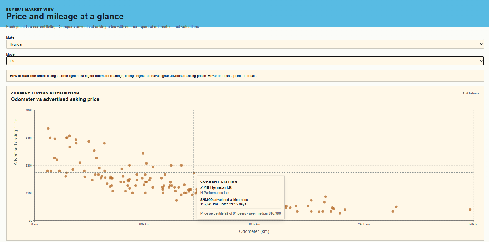
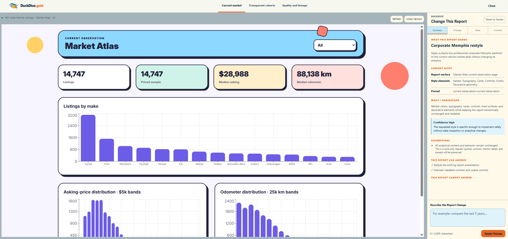
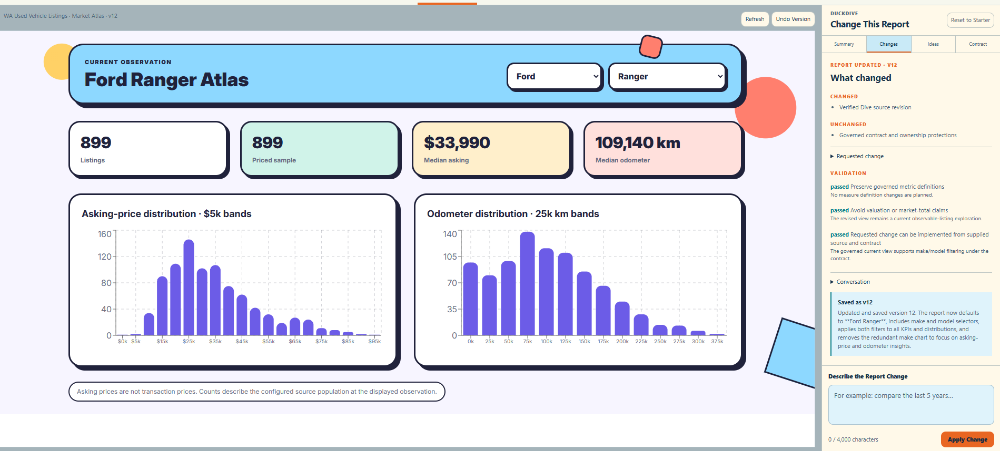
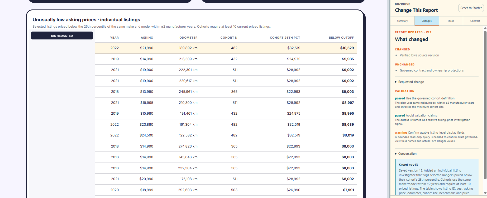
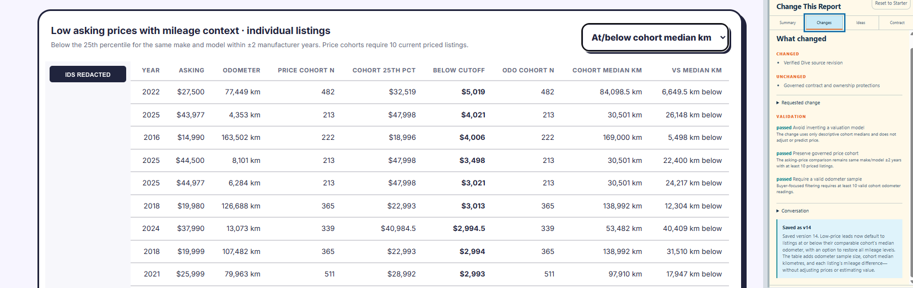
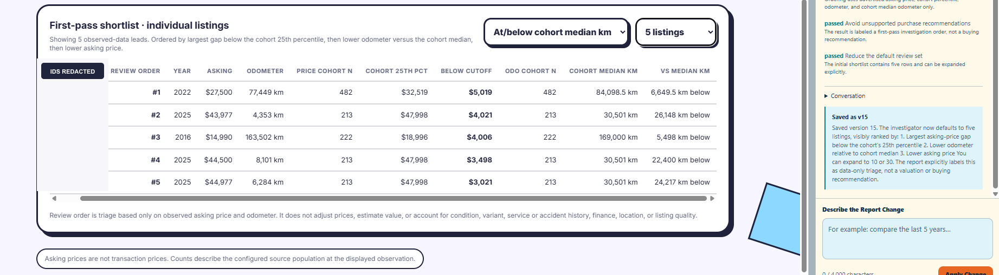
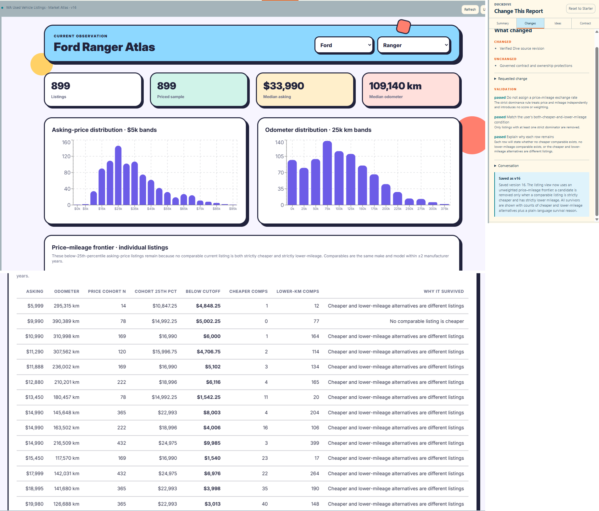
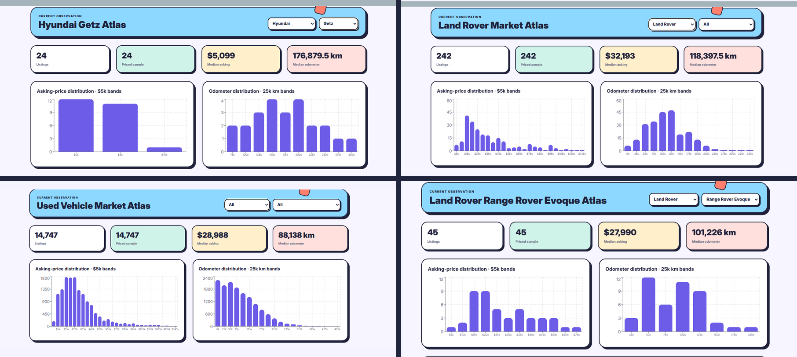
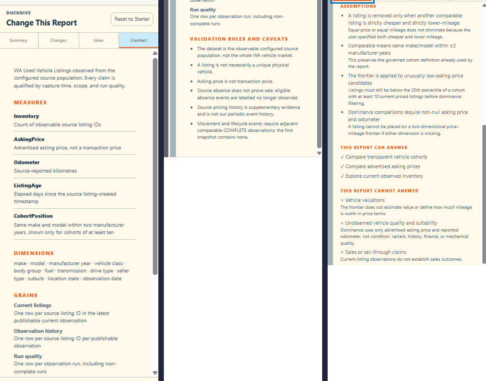

# From one Ranger question to a market-wide frontier

One practical question changed the shape of the analysis: **how can price and mileage both matter without pretending to know what one is worth in terms of the other?**

This case study traces how a conversation changed an ordinary vehicle report into a reusable price-mileage frontier. The result preserves price and odometer as separate measures, evaluates each listing within a governed peer group, generalizes from Ford Ranger to market-wide display states, and stops short of valuation or purchase advice.

Its significance is not the vehicle market alone. It is evidence for a broader DuckDive hypothesis: a person can progressively make a decision problem explicit, an agent can help translate it into an audience-ready report, and governed contracts can preserve what the data means and what the report must not claim.

## Read the evidence boundary first

This page describes a historical session observed on 11 August 2026. It does not describe current application, MotherDuck, or Embedded Dives state.

| Evidence class | What this page uses |
| --- | --- |
| Observed artifacts | A supplied conversation transcript and review-safe derivatives of screenshots captured on 11 August 2026 |
| Editorial composites | Assets 04, 05, 07, 08, and 09 combine observed screenshot fragments and identify themselves as composites |
| Reference reconstruction | [Executable SQL](../../db/case-studies/price-mileage-frontier.sql), a [synthetic fixture](../../fixtures/case-studies/price-mileage-frontier.json), and an [independent TypeScript verifier](../../scripts/verify-price-frontier.ts) recreate the documented method; no historical analytical result has been reconstructed |
| Unavailable evidence | The original version 16 Dive source, its complete prompt history, its generated query or report source, and live MotherDuck access |

Every displayed market value on this page belongs to the 11 August observation. Version numbers and cohort parameters describe the observed report logic. No value from a later observation appears here.

The [visual-evidence gallery](../assets/price-frontier/README.md), [asset manifest](../assets/price-frontier/manifest.json), and [Work package 3 evidence record](../review/WORK_PACKAGE_3_EVIDENCE.md) document the source hashes, redactions, crops, and composite boundaries.

## Follow the analytical evolution

The conversation progressively expressed a decision problem. Each accepted version changed the report while retaining its evidence limits.

### 1. Start with a conventional report

The initial report plots advertised asking price against source-reported odometer. It supports exploration, but it leaves the reader to interpret a heterogeneous market without a governed candidate rule.



Observed screenshot from 11 August 2026. Asking price remains an advertised amount, not a transaction price or estimated value.

### 2. Prove that conversation can change presentation

The Corporate Memphis request is the low-cost proof of report mutation. Version 8 changes cards, charts, typography, controls, and decorative geometry while retaining the report’s measures and analytical scope.



Observed screenshot from 11 August 2026. The presentation changes, but the current-market analysis remains intact.

### 3. Scope the report without hard-coding the question

The next request makes the report useful for a Ford Ranger investigation. Version 12 defaults to Ford and Ranger, exposes make and model as independent selectors, and applies both controls to key measures and distributions.



The visible version 12 panel records three validations:

- Governed measure definitions remain unchanged
- The report avoids valuation and market-total claims
- The existing source and contract support make-and-model filtering

The saved change also removes the redundant make chart. The report solves the immediate Ranger problem through parameters rather than a fixed Ford/Ranger query.

### 4. Add a cohort-relative candidate rule

The next question asks which asking prices are unusual within legitimate peer groups. Version 13 flags listings below their cohort’s 25th-percentile asking price.



The visible version 13 panel defines a cohort as the same make and model within plus or minus two manufacturer years. It withholds the rule unless the cohort contains at least 10 current priced listings. The panel preserves the boundary between a relative asking-price signal and a valuation claim.

The panel also records a warning that listing display fields need bounded read-only confirmation. Its saved state then identifies the fields included in the table.

### 5. Add mileage context without estimating value

The candidate list exposes a practical weakness: a low asking price can accompany high mileage. Version 14 adds odometer cohort size, cohort median odometer, and each listing’s distance from that median.



The visible version 14 panel records three safeguards:

- It does not invent a valuation model
- It preserves the governed price cohort
- It requires at least 10 valid odometer readings for the odometer comparison

The report can filter to listings at or below their cohort median odometer. It does not adjust price or estimate the monetary effect of mileage.

### 6. Reduce the review set without recommending a purchase

The next request asks for fewer listings to investigate. Version 15 defaults to five rows and lets the reader expand the set.



The visible version 15 panel orders the review set by price gap below the cohort threshold, then lower odometer relative to the cohort median, then lower asking price. Its validation text calls the result data-only triage and rejects purchase-recommendation language.

### 7. Replace ranking with strict two-dimensional dominance

The final analytical request removes any implied conversion between dollars and kilometres:

> Price and mileage both matter, but do not decide how much one is worth relative to the other. Remove a listing only when another comparable listing is both cheaper and lower-mileage.

Version 16 implements a strict price-mileage frontier. It removes a candidate only when one comparable peer improves strictly on both observed measures.



The visible version 16 panel records three validations:

- No price-mileage exchange rate, score, or weighting is introduced
- Removal requires the same peer to be both strictly cheaper and strictly lower-mileage
- Every survivor receives comparable counts and a plain-language survival reason

The original version 16 Dive source is not preserved in this repository. The image is a labelled composite of observed screenshots, not a reconstructed report execution.

### 8. Change controls to test generalization

The make and model controls reveal that version 16 is not limited to Ford Ranger. The observed states include Hyundai Getz, Land Rover/All, All/All, and Land Rover Range Rover Evoque.



Each control state changes the title, population counts, measures, and distributions. The visible frontier description continues to define comparables at the same-make-and-model year-window grain.

### 9. Expand the display to All/All

The All/All state expands the display without turning unlike vehicles into peers. The observed 11 August frame shows 14,747 listings, a $28,988 median asking price, and an 88,138 km median odometer.

The market-wide table is therefore interpreted as a union of local frontiers. A row survives within its own governed peer group before the report includes it in the broader display. A low-priced small car and a high-priced specialist vehicle can appear together without direct dominance comparison.

### 10. Reveal the contract and refusal boundaries

The final reveal is the contract rather than another visualization. It defines asking price, odometer, cohort position, grains, validation caveats, and unsupported interpretations.



The observed contract states that advertised asking price is not a transaction price. It also states that source absence does not prove sale and that the frontier does not estimate vehicle value or suitability.

## Keep three analytical scopes separate

The frontier remains coherent because display, candidate, and dominance scopes answer different questions:

| Scope | Question | Rule |
| --- | --- | --- |
| Display scope | Which results should the report show? | Selected make/model, make/All, or All/All |
| Candidate rule | Which listings may enter the frontier test? | Asking price below the listing’s own cohort 25th percentile, with at least 10 current priced listings |
| Dominance scope | Which peers may remove a candidate? | Same make and model within plus or minus two manufacturer years |

Changing display scope does not broaden comparison scope. Land Rover/All can show results from several Land Rover models while each row remains evaluated against its own model and year window.

## Apply strict dominance without a score

A comparable peer removes a candidate only when both inequalities hold:

```sql
peer.asking_price < candidate.asking_price
AND peer.odometer < candidate.odometer
```

The inequalities are strict. Equal asking price is not cheaper, and equal odometer is not lower-mileage, so equality on either measure cannot dominate a candidate.

A surviving row has one of three explanations:

- No comparable peer is cheaper
- No comparable peer has lower mileage
- Cheaper peers and lower-mileage peers exist, but they are different listings

The third case matters because separate peers cannot be combined into an imaginary dominating vehicle. One actual comparable listing must improve on both measures.

## Normalize through comparability semantics

The All/All report spans a heterogeneous market, but it does not transform raw measures into a universal score. Local cohort rules perform the normalization through comparability semantics.

The candidate rule asks whether an asking price is unusual within a governed local cohort. The dominance rule then compares price and odometer only among legitimate peers. The report unions the local survivors after those tests, so dollars remain dollars and kilometres remain kilometres.

This method introduces no exchange rate between price and mileage. It also introduces no predicted value, trained model, or global ranking across unlike vehicles.

## Reject claims that exceed the evidence

The observed contract identifies nearby requests that the report cannot support:

| Unsupported request | Why the evidence is insufficient | Supported alternative |
| --- | --- | --- |
| Estimate fair value | Advertised asking prices are not transactions, and the report has no valuation model | Compare observed asking prices within governed cohorts |
| Tell the reader which vehicle to buy | The source does not establish condition, suitability, finance, accident history, or mechanical quality | Present transparent candidates and survival reasons for human investigation |
| Identify vehicles that sold | A missing source listing does not establish a sale or transaction outcome | Describe a listing as no longer observed when the evidence supports that state |

These are observed contract boundaries, not proof that semantic classification is deterministic. The agent still interprets requests through a model-mediated step. The separate [bounded control-loop evidence](../agent-control-loop.md) tests how deterministic enforcement constrains the consequences of that interpretation.

## State what the case study establishes

The observed session shows a report evolving from presentation changes into governed analytical decision support. A concrete Ranger question produced a parameterized procedure that remained coherent across broader display states.

The case study does not reproduce the original version 16 source or verify a live deployment. The credential-free reference reconstruction runs the documented frontier semantics in DuckDB and in an independent TypeScript implementation against synthetic cases. `pnpm review:verify` requires no `.env.local` and compares every evaluation row before checking the named edge cases.

This establishes a reusable pattern, not an industry-agnostic product: progressively define a decision view, keep comparisons local to legitimate cohorts, preserve the source and analytical limits, and refuse conclusions the evidence cannot support. Repeating that pattern with materially different datasets is the next test.
